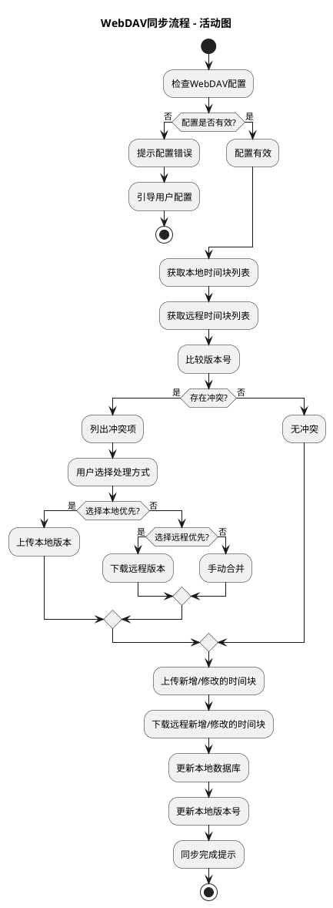
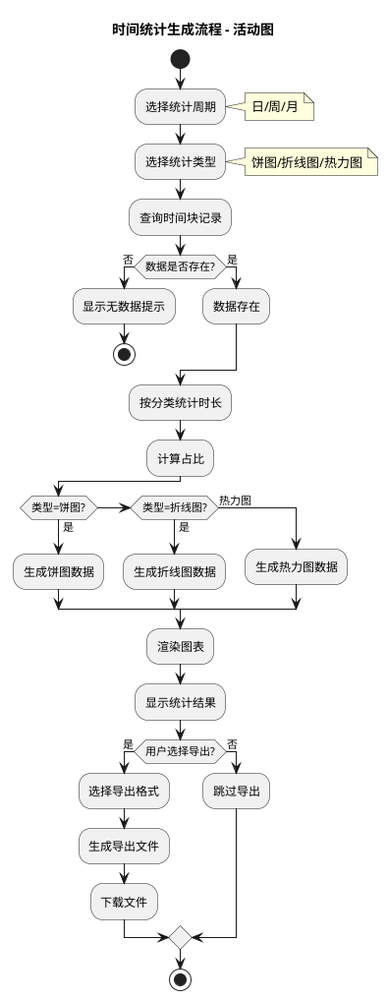

# TimeBlock 项目 UML 图

---

## 一、用例图 (Use Case Diagram)

### 1.1 主要用户角色与用例

```plantuml
@startuml TimeBlock_用例图
' 标题
title TimeBlock 时间块记录器 - 用例图

' 用户角色
actor 用户 as User
actor 管理员 as Admin

' 系统边界
rectangle "TimeBlock 系统" as System {
  ' 时间块管理用例
  usecase "创建时间块" as UC1
  usecase "编辑时间块" as UC2
  usecase "删除时间块" as UC3
  usecase "查看时间块" as UC4
  
  ' 视图浏览用例
  usecase "日视图浏览" as UC5
  usecase "周视图浏览" as UC6
  usecase "月视图浏览" as UC7
  
  ' 数据同步用例
  usecase "WebDAV同步" as UC8
  usecase "云端同步" as UC9
  
  ' 用户管理用例
  usecase "登录" as UC10
  usecase "注册" as UC11
  usecase "修改密码" as UC12
  
  ' 统计分析用例
  usecase "查看统计报表" as UC13
  usecase "导出数据" as UC14
  
  ' 系统设置用例
  usecase "配置WebDAV" as UC15
  usecase "管理分类" as UC16
  usecase "主题切换" as UC17
}

' 管理员专用用例
rectangle "管理员功能" as AdminSystem {
  usecase "用户管理" as UC18
  usecase "系统监控" as UC19
}

' 角色与用例关联
User --> UC1 : 创建
User --> UC2 : 编辑
User --> UC3 : 删除
User --> UC4 : 查看
User --> UC5 : 浏览
User --> UC6 : 浏览
User --> UC7 : 浏览
User --> UC8 : 执行
User --> UC9 : 执行
User --> UC10 : 登录
User --> UC11 : 注册
User --> UC12 : 修改
User --> UC13 : 查看
User --> UC14 : 导出
User --> UC15 : 配置
User --> UC16 : 管理
User --> UC17 : 切换

Admin --> UC18 : 管理
Admin --> UC19 : 监控
Admin --> UC13 : 查看

@enduml
```



---

## 二、活动图 (Activity Diagram)

### 2.1 时间块创建流程

```plantuml
@startuml TimeBlock_创建流程
' 标题
title 时间块创建流程 - 活动图

' 开始节点
start

' 用户选择日期和时间
:选择日期;
:选择开始时间;
:选择结束时间;

' 输入任务信息
:输入任务名称;
:选择分类;

' 验证时间是否冲突
if (时间是否冲突?) then (是)
  :提示时间冲突;
  :返回重新选择时间;
  backward:选择开始时间;
else (否)
  :验证通过;
endif

' 保存时间块
:保存到本地SQLite;

' 判断是否自动同步
if (开启自动同步?) then (是)
  :触发WebDAV同步;
  if (同步成功?) then (是)
    :同步成功提示;
  else (否)
    :同步失败提示;
    :数据标记为待同步;
  endif
else (否)
  :跳过同步;
endif

' 结束
:显示创建成功;
stop

@enduml
```

### 2.2 WebDAV同步流程



### 2.3 用户登录流程

```plantuml
@startuml TimeBlock_登录流程
' 标题
title 用户登录流程 - 活动图

' 开始节点
start

' 输入登录信息
:输入用户名;
:输入密码;

' 本地验证
:检查本地缓存;

if (本地缓存有效?) then (是)
  :直接登录成功;
  :加载用户数据;
  stop
else (否)
  :请求后端API;
endif

' 后端验证
if (验证成功?) then (是)
  :返回JWT Token;
  :保存Token到本地;
  :加载用户数据;
else (否)
  :显示错误信息;
  if (是否重试?) then (是)
    backward:输入用户名;
  else (否)
    :返回首页;
    stop
  endif
endif

' 结束
stop

@enduml
```

### 2.4 时间统计生成流程



---

## 三、UML图使用说明

### 3.1 如何渲染PlantUML

**在线渲染：**
1. 访问 PlantUML 官方在线编辑器：https://www.planttext.com/
2. 复制上述代码块到编辑器中
3. 点击 "Submit" 按钮即可生成图表

**本地渲染：**
1. 安装 PlantUML：`brew install plantuml`（macOS）或下载安装包
2. 保存代码为 `.pu` 文件
3. 执行命令：`plantuml filename.pu`
4. 生成 PNG/SVG 格式图片

### 3.2 图说明

| 图表类型 | 文件名 | 描述 |
|----------|--------|------|
| 用例图 | UseCase.pu | 展示系统功能范围和用户角色 |
| 活动图-创建 | Activity_Create.pu | 时间块创建完整流程 |
| 活动图-同步 | Activity_Sync.pu | WebDAV同步完整流程 |
| 活动图-登录 | Activity_Login.pu | 用户登录完整流程 |
| 活动图-统计 | Activity_Report.pu | 统计报表生成流程 |

---

*文档版本: v1.0*
*创建日期: 2026-06-07*